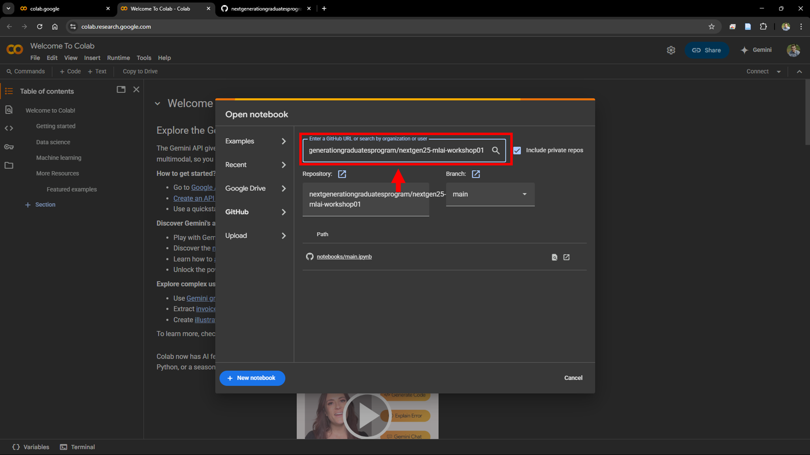

<h1>CSIRO NextGen25 Machine Learning Workshop #1</h1>

This workshop is designed to give participants a **foundational, conceptual understanding** of machine learning by focusing on the fundamental idea: machine learning is the process of **learning functions from data**. Rather than centering on specific architectures or black-box model usage, this workshop takes a bottom-up approach — exploring what it means to define, approximate, and optimize functions based on noisy observations.

<h2>:wrench: Setup</h2> 

Access the [Google Colab](https://colab.google/) website and open the colab service as shown below.

    

Open a notebook from a GitHub repository as shown below.

    

Paste the URL to the GitHub repository for this workshop ([NextGen25 MLAI Workshop 01](https://github.com/nextgenerationgraduatesprogram/nextgen25-mlai-workshop01)) in the search field as shown below.

    

Lastly, launch the notebook to get started!

    

